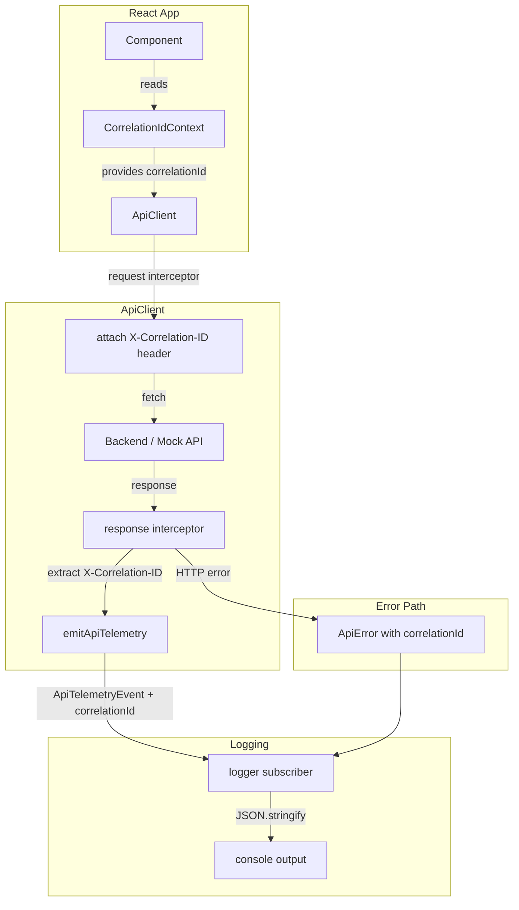

# Design: Structured Logging + Correlation IDs

## Overview

This feature adds structured JSON logging and correlation ID propagation to the YieldVault-RWA off-chain layer (the React/TypeScript frontend and its API client). The goal is to make every API call traceable end-to-end: each request carries a unique `X-Correlation-ID` header, that ID flows through telemetry events and error objects, and all log output is machine-readable JSON with a consistent field schema.

The scope is intentionally limited to the off-chain layer — the frontend API client (`frontend/src/lib/api/`), the telemetry bus, and the React context that exposes the current correlation ID to components. On-chain Soroban contracts are out of scope.

### Key Design Decisions

- **No new runtime dependencies for logging**: The existing telemetry pub/sub system (`telemetry.ts`) is extended rather than replaced. A thin `logger` module subscribes to telemetry events and writes structured JSON to `console`.
- **Interceptor-based correlation ID injection**: The existing `ApiClient` interceptor API is used to attach `X-Correlation-ID` on every request and read it back from responses, keeping the concern isolated.
- **React Context for correlation ID**: A `CorrelationIdContext` makes the active ID available to any component without prop drilling, consistent with how `ThemeContext` and `ToastContext` are already structured.
- **UUID v4 via `crypto.randomUUID()`**: Available in all modern browsers and Node 14.17+; no library needed.

---

## Architecture



The data flow is:

1. A component (or script) obtains or generates a correlation ID.
2. The `ApiClient` request interceptor reads the ID from context and sets the header.
3. On response, the response interceptor reads the echoed header (if present) and attaches it to the telemetry event.
4. The logger subscriber formats the event as a JSON log entry and writes it.
5. Errors carry the correlation ID so they can be correlated with the request log line.

---

## Components and Interfaces

### `logger` module (`frontend/src/lib/logger.ts`)

Thin structured-logging facade. Subscribes to the telemetry bus and also exposes a direct `log()` function for non-telemetry log sites.

```typescript
export type LogLevel = "debug" | "info" | "warn" | "error";

export interface LogEntry {
  timestamp: string;       // ISO 8601
  level: LogLevel;
  message: string;
  correlationId?: string;
  method?: string;
  url?: string;
  durationMs?: number;
  attempt?: number;
  status?: number;
  errorCode?: string;
  [key: string]: unknown;  // extensible for future fields
}

export interface LoggerConfig {
  minLevel: LogLevel;
  output?: (entry: LogEntry) => void; // defaults to console.log(JSON.stringify(entry))
}

export function configureLogger(config: LoggerConfig): void;
export function log(level: LogLevel, message: string, fields?: Partial<LogEntry>): void;
```

Log level ordering: `debug < info < warn < error`. Entries below `minLevel` are silently dropped.

### `CorrelationIdContext` (`frontend/src/context/CorrelationIdContext.tsx`)

React context that holds the active correlation ID for the current "session" or user interaction.

```typescript
export interface CorrelationIdContextValue {
  correlationId: string;
  /** Replace the active ID (e.g. when starting a new user action). */
  refreshCorrelationId: () => void;
}

export const CorrelationIdContext: React.Context<CorrelationIdContextValue>;
export function CorrelationIdProvider({ children }: { children: React.ReactNode }): JSX.Element;
export function useCorrelationId(): CorrelationIdContextValue;
```

The provider generates a UUID v4 on mount and exposes `refreshCorrelationId` to rotate it.

### `correlationInterceptors` (`frontend/src/lib/api/correlationInterceptors.ts`)

Two `ApiClient` interceptors that handle ID injection and extraction.

```typescript
/**
 * Request interceptor: reads correlationId from the provided getter and
 * sets the X-Correlation-ID header on every outgoing request.
 */
export function createCorrelationRequestInterceptor(
  getCorrelationId: () => string,
): RequestInterceptor;

/**
 * Response interceptor: reads X-Correlation-ID from the response headers
 * and attaches it to the telemetry context for downstream logging.
 */
export function createCorrelationResponseInterceptor(): ResponseInterceptor;
```

### Extended `ApiTelemetryEvent` (`frontend/src/lib/api/telemetry.ts`)

Each event variant gains an optional `correlationId` field:

```typescript
// Added to every event variant:
correlationId?: string;
```

### Extended `ApiError` (`frontend/src/lib/api/error.ts`)

`ApiErrorMetadata` and `ApiError` gain:

```typescript
correlationId?: string;
```

---

## Data Models

### Log Entry Schema

Every log line written to `console` is a single-line JSON object conforming to `LogEntry`:

| Field | Type | Required | Description |
|---|---|---|---|
| `timestamp` | string (ISO 8601) | yes | When the entry was created |
| `level` | `"debug"\|"info"\|"warn"\|"error"` | yes | Severity |
| `message` | string | yes | Human-readable summary |
| `correlationId` | string (UUID v4) | no | Active correlation ID |
| `method` | string | no | HTTP method (GET, POST, …) |
| `url` | string | no | Full request URL |
| `durationMs` | number | no | Round-trip time in milliseconds |
| `attempt` | number | no | Retry attempt number (1-based) |
| `status` | number | no | HTTP response status code |
| `errorCode` | string | no | `ApiErrorCode` value on error |

Example output:

```json
{"timestamp":"2026-01-15T10:23:45.123Z","level":"info","message":"API request succeeded","correlationId":"f47ac10b-58cc-4372-a567-0e02b2c3d479","method":"GET","url":"https://api.example.com/mock-api/vault-summary.json","durationMs":142,"attempt":1,"status":200}
```

### Correlation ID Format

UUID v4 as produced by `crypto.randomUUID()`. Example: `f47ac10b-58cc-4372-a567-0e02b2c3d479`.

Pattern: `/^[0-9a-f]{8}-[0-9a-f]{4}-4[0-9a-f]{3}-[89ab][0-9a-f]{3}-[0-9a-f]{12}$/i`

### Header Convention

| Header | Direction | Description |
|---|---|---|
| `X-Correlation-ID` | Request (client → server) | Client-generated or client-propagated ID |
| `X-Correlation-ID` | Response (server → client) | Server echoes or overrides the ID |
| `X-Trace-ID` | Response (server → client) | Already read by `ApiClient`; stored on `ApiError.traceId` (unchanged) |

---

## Correctness Properties

*A property is a characteristic or behavior that should hold true across all valid executions of a system — essentially, a formal statement about what the system should do. Properties serve as the bridge between human-readable specifications and machine-verifiable correctness guarantees.*

### Property 1: Every outgoing request carries a correlation ID header

*For any* API request made through `ApiClient` when the correlation request interceptor is registered, the outgoing `Headers` object must contain an `X-Correlation-ID` entry with a non-empty string value.

**Validates: Requirements 1.1**

---

### Property 2: Client-supplied correlation ID takes precedence

*For any* API request where the caller provides a specific correlation ID via the context getter, the `X-Correlation-ID` header on the outgoing request must equal that provided ID, not a freshly generated one.

**Validates: Requirements 1.3**

---

### Property 3: Generated correlation IDs are valid UUID v4

*For any* call to the correlation ID generation function, the returned string must match the UUID v4 format pattern `/^[0-9a-f]{8}-[0-9a-f]{4}-4[0-9a-f]{3}-[89ab][0-9a-f]{3}-[0-9a-f]{12}$/i`.

**Validates: Requirements 1.4**

---

### Property 4: All observable outputs carry the correlation ID

*For any* API request that completes (successfully or with an error), the resulting telemetry event and any resulting `ApiError` must both carry the same `correlationId` value that was sent on the request.

**Validates: Requirements 2.1, 2.2**

---

### Property 5: Log entries serialize to valid JSON with all required fields

*For any* log entry produced by the logger (at any level), calling `JSON.stringify` on it must produce valid JSON, and the parsed object must contain `timestamp`, `level`, and `message` fields with the correct types.

**Validates: Requirements 2.3, 3.1**

---

### Property 6: Log level filtering excludes entries below threshold

*For any* logger configuration with `minLevel` set to level L, and *for any* log entry with a level below L, that entry must not appear in the output (the `output` function must not be called for it).

**Validates: Requirements 3.2**

---

### Property 7: Correlation ID is accessible throughout the React component tree

*For any* component rendered as a descendant of `CorrelationIdProvider`, calling `useCorrelationId()` must return the same `correlationId` value that the provider holds, regardless of nesting depth.

**Validates: Requirements 4.2**

---

## Error Handling

### Missing or malformed `X-Correlation-ID` in response

If the server does not echo `X-Correlation-ID`, the client retains the ID it generated for the request. No error is thrown; the field is simply absent from the response-side telemetry.

### `crypto.randomUUID()` unavailability

`crypto.randomUUID()` is available in all browsers that support the Web Crypto API (Chrome 92+, Firefox 95+, Safari 15.4+). If unavailable (e.g., non-secure context in very old browsers), the interceptor falls back to a timestamp-based pseudo-ID prefixed with `fallback-` and logs a `warn` entry. This is a graceful degradation path, not a hard failure.

### Logger output errors

If the `output` function throws (e.g., a custom output sink fails), the error is caught and silently swallowed to prevent logging from disrupting the application. A single `console.error` is written as a last resort.

### Correlation ID context outside provider

If `useCorrelationId()` is called outside `CorrelationIdProvider`, it throws a descriptive error: `"useCorrelationId must be used within a CorrelationIdProvider"`. This matches the pattern used by `ToastContext`.

---

## Testing Strategy

### Dual Testing Approach

Both unit tests and property-based tests are used. Unit tests cover specific examples, integration points, and error conditions. Property tests verify universal invariants across many generated inputs.

### Property-Based Testing Library

**fast-check** is the chosen PBT library for TypeScript/Vitest. It integrates cleanly with Vitest via `fc.assert(fc.property(...))` and supports async properties.

Install: `npm install --save-dev fast-check`

Each property test runs a minimum of **100 iterations** (fast-check default is 100; set explicitly via `{ numRuns: 100 }`).

Each property test is tagged with a comment in the format:
`// Feature: structured-logging-correlation-ids, Property N: <property_text>`

### Property Tests

Each correctness property maps to exactly one property-based test:

**Property 1** — `correlationInterceptors.test.ts`
```
// Feature: structured-logging-correlation-ids, Property 1: Every outgoing request carries a correlation ID header
fc.assert(fc.asyncProperty(fc.record({ method: fc.constantFrom('GET','POST'), path: fc.string() }), async ({ method, path }) => {
  // build request context, run interceptor, assert headers.get('X-Correlation-ID') is non-empty
}))
```

**Property 2** — `correlationInterceptors.test.ts`
```
// Feature: structured-logging-correlation-ids, Property 2: Client-supplied correlation ID takes precedence
fc.assert(fc.asyncProperty(fc.uuid(), async (suppliedId) => {
  // provide suppliedId via getter, run interceptor, assert header === suppliedId
}))
```

**Property 3** — `correlationId.test.ts`
```
// Feature: structured-logging-correlation-ids, Property 3: Generated correlation IDs are valid UUID v4
fc.assert(fc.property(fc.integer({ min: 1, max: 1000 }), (_n) => {
  const id = generateCorrelationId();
  return UUID_V4_PATTERN.test(id);
}))
```

**Property 4** — `logger.test.ts`
```
// Feature: structured-logging-correlation-ids, Property 4: All observable outputs carry the correlation ID
fc.assert(fc.asyncProperty(fc.uuid(), fc.constantFrom('success','error'), async (correlationId, outcome) => {
  // simulate telemetry event with correlationId, assert logger output and ApiError carry same ID
}))
```

**Property 5** — `logger.test.ts`
```
// Feature: structured-logging-correlation-ids, Property 5: Log entries serialize to valid JSON with required fields
fc.assert(fc.property(fc.record({ level: fc.constantFrom('debug','info','warn','error'), message: fc.string() }), ({ level, message }) => {
  const entry = buildLogEntry(level, message, {});
  const parsed = JSON.parse(JSON.stringify(entry));
  return typeof parsed.timestamp === 'string' && typeof parsed.level === 'string' && typeof parsed.message === 'string';
}))
```

**Property 6** — `logger.test.ts`
```
// Feature: structured-logging-correlation-ids, Property 6: Log level filtering excludes entries below threshold
fc.assert(fc.property(
  fc.constantFrom('debug','info','warn','error'),
  fc.constantFrom('debug','info','warn','error'),
  (minLevel, entryLevel) => {
    // configure logger with minLevel, emit entry at entryLevel
    // assert output was called iff levelOrder[entryLevel] >= levelOrder[minLevel]
  }
))
```

**Property 7** — `CorrelationIdContext.test.tsx`
```
// Feature: structured-logging-correlation-ids, Property 7: Correlation ID accessible throughout React tree
fc.assert(fc.property(fc.integer({ min: 1, max: 10 }), (depth) => {
  // render CorrelationIdProvider with a component nested `depth` levels deep
  // assert useCorrelationId() returns the provider's ID
}))
```

### Unit Tests

- `correlationInterceptors.test.ts`: missing header fallback, non-secure context fallback to `fallback-` prefix
- `logger.test.ts`: `configureLogger` reads `VITE_LOG_LEVEL` env var (example for Requirement 4.1), output-function error is swallowed
- `CorrelationIdContext.test.tsx`: `refreshCorrelationId` produces a new UUID v4, calling hook outside provider throws descriptive error
- `client.test.ts` (existing): verify interceptors are invoked in order; extend existing tests to assert `correlationId` on `ApiError`
