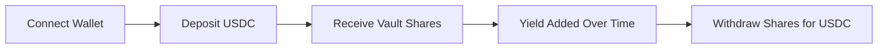
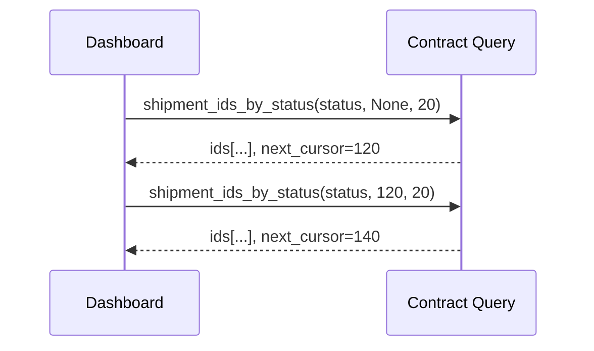

# YieldVault User Guide

This guide explains how to use the vault in plain language and how to read the dashboard values.

## 1. What the Vault Does

You deposit USDC into the vault.
In return, you receive vault shares.
Those shares represent your portion of the pool.
When yield is added, each share becomes worth more USDC.

## 2. Basic Flow

## 3. How to Deposit

1. Connect your wallet.
2. Enter the USDC amount in the deposit input.
3. Confirm the transaction.
4. Wait for confirmation.
5. Check that your share balance increased.

## 4. How to Withdraw

1. Open the withdraw section.
2. Enter how many shares you want to redeem.
3. Confirm the transaction.
4. Your wallet receives USDC based on the current share value.

## 5. Dashboard Fields Explained

- TVL: Total Value Locked. This is the total USDC-equivalent assets tracked by the vault.
- Total Shares: Total share supply across all users.
- Your Shares: Your current ownership units in the vault.
- Share Price: Approximate value of one share.
  Formula: total_assets / total_shares.
- Strategy Yield Events: Records when strategy yield is added.

## 6. Reading Yield Correctly

If total assets go up while your share count stays the same, your position value grows.
You do not need to claim separate reward tokens in this model.
The gain is embedded in share value.

## 7. Shipment Status Pagination (For Ops Views)

If an operations page lists shipments by status, results are loaded in pages.
Use the returned next_cursor token to request the next page.

## 8. Troubleshooting

- Deposit fails: Check wallet balance and network.
- Withdraw returns less than expected: Share value may have changed due to prior withdrawals.
- No new yield shown: Strategy may not have reported yield in that period.
